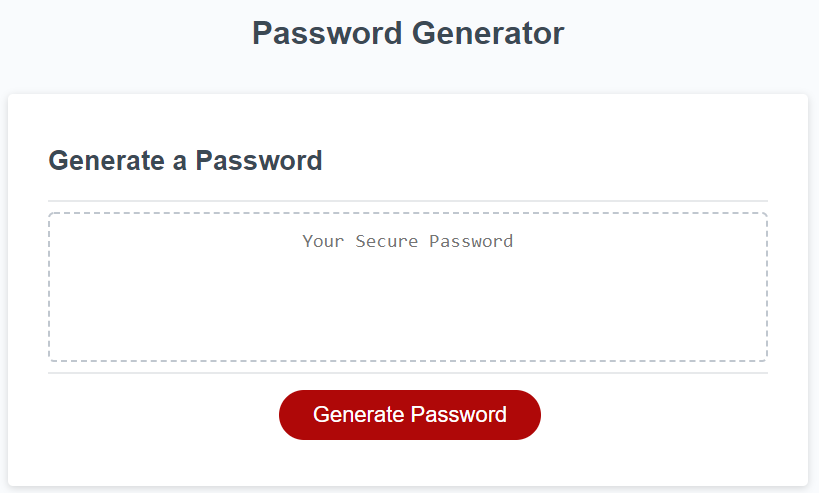

# Password-Generator

This is an application to generator a password.

## Description

The application works by prompting the user with a series of questions in order to create a password that meets the requirements.
Questions are asked through prompts and must be answered appropriately. If an answer is not answered with an appropriate answer, the program will alert the user and reprompt the question.
Questions are:
1. Length of password?
2. Include lowercase characters?
3. Include UPPERCASE characters?
4. 

## Getting Started
[Launch Password Generator](https://dmmerchant.github.io/Password-Generator/)

### Dependencies

* Strictly HTML, CSS, and Javascript. No additional additional requirements

